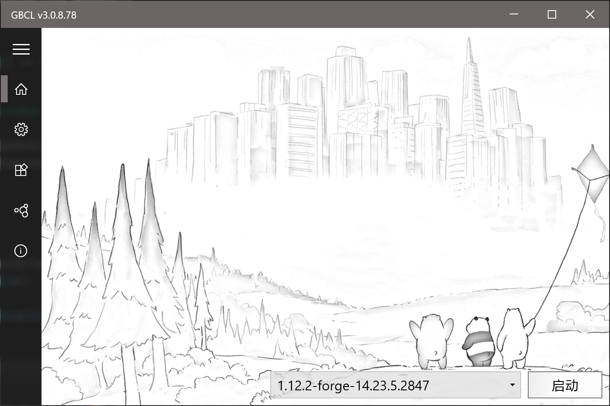
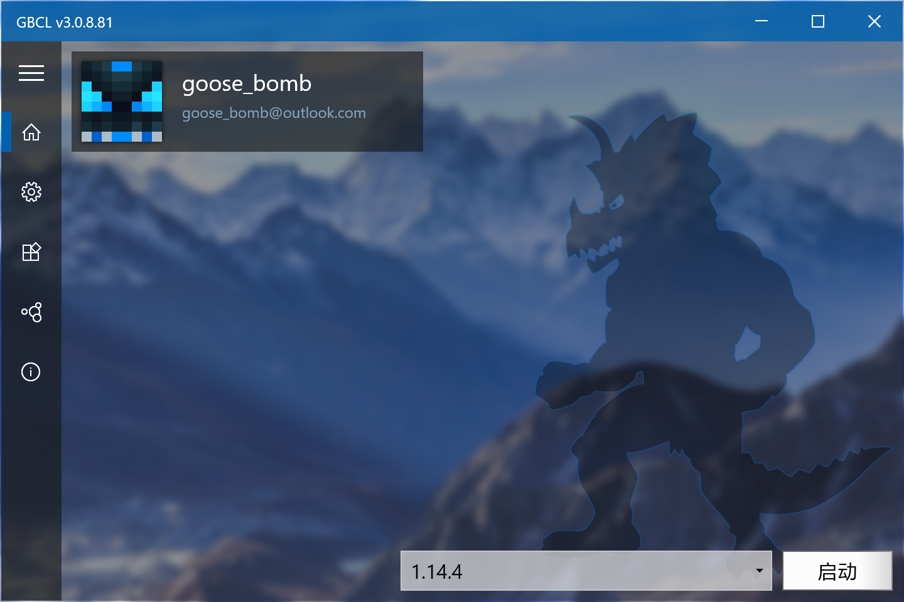
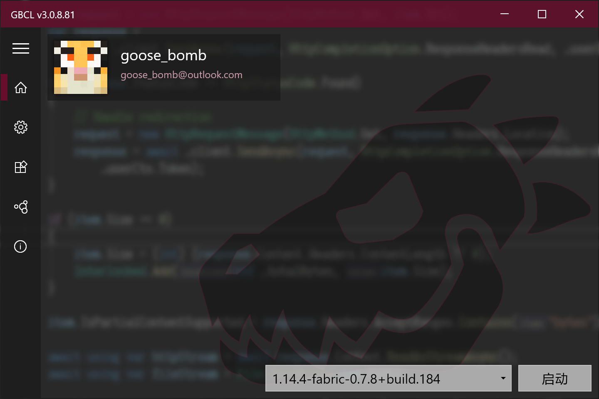
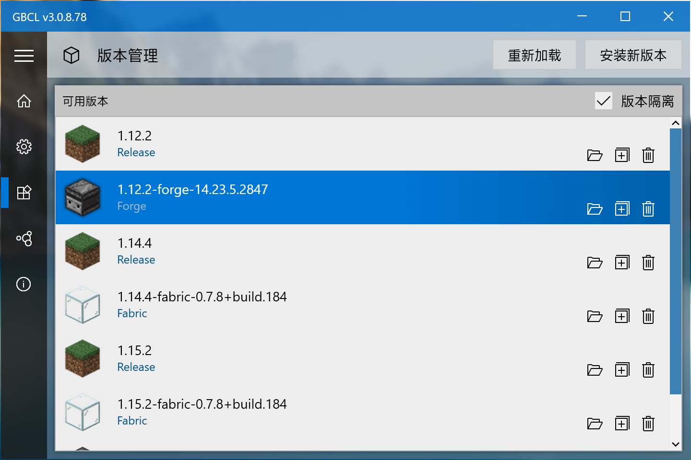
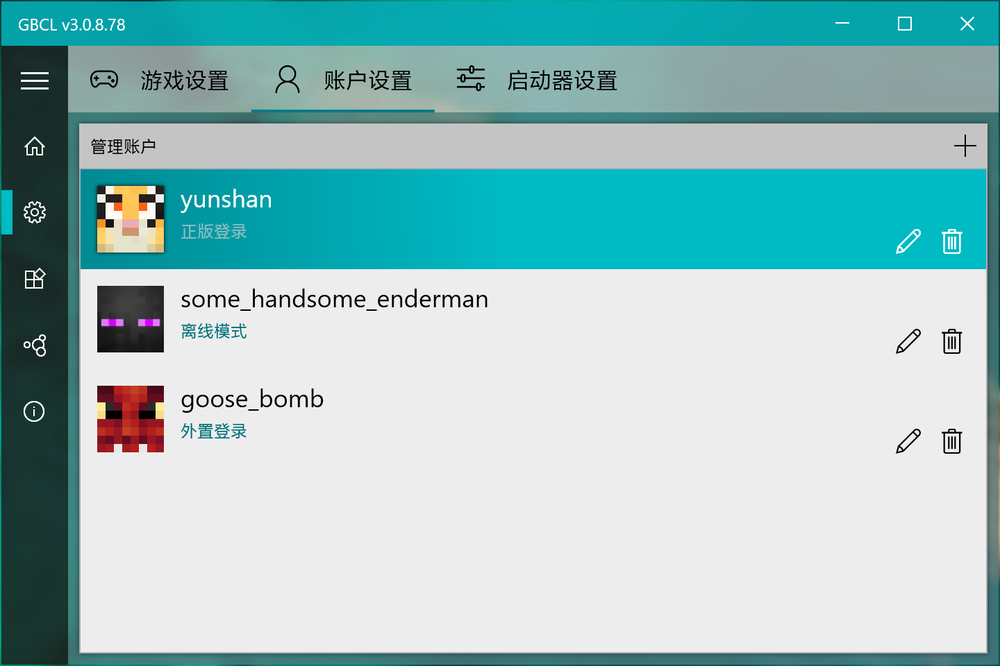
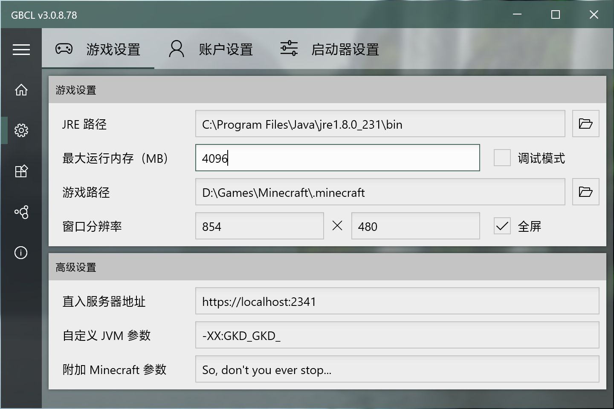
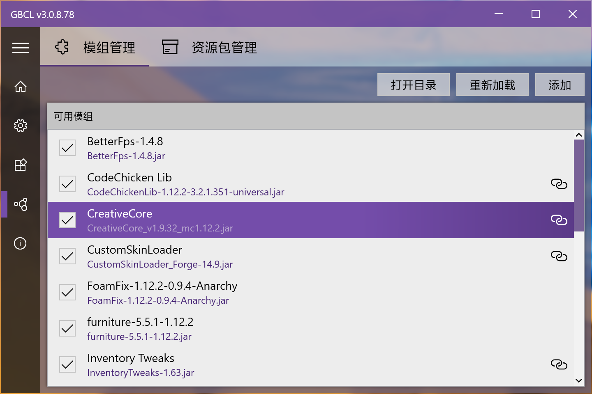
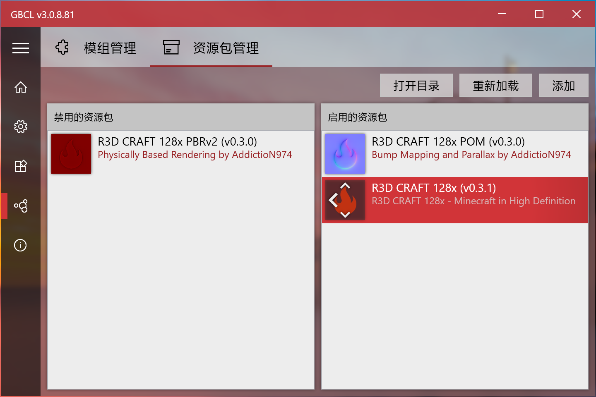

  
  <h2 align="center">GBCLV3</h2>
  

    
    
        
    
    <a href="https://github.com/Goose-Bomb/GBCLV3/releases">
      
          
    </a>
  

  
鹅弹的Minecraft客户端启动器 V3

## 系统要求
* Windows 10 64 操作系统
* 需要 [.NET Core 3.1 桌面运行时](https://dotnet.microsoft.com/download/dotnet-core/3.1)

## 亮点

* MVVM框架 🧶
* 简单易用 (但愿吧 🤣)
* Win10 风格 😎✨

## 功能

- [x] 游戏启动
  - [x] 自动检测 JRE 路径
  - [x] 版本分离
  - [x] 1.13+ 支持
  - [x] Forge 版本
  - [x] Fabric 版本

- [x] 验证登录
  - [x] 账户管理
  - [x] 邮箱密码登录
  - [x] 令牌刷新
  - [x] 外置登录（基于 [authlib-injector](https://github.com/yushijinhun/authlib-injector)）

- [x] 下载安装
  - [x] 并发下载
  - [x] 重试失败下载
  - [x] 修复损坏依赖文件 (主 jar, 依赖库, 资源文件)
  - [x] 安装新版本
  - [x] 安装 Forge (支持1.13.2+新版forge全自动安装)
  - [x] 安装 Fabric

- [ ] 主题
  - [x] 窗口毛玻璃模糊
  - [x] 自定义背景图
  - [x] 自定义字体
  - [x] 使用系统主题色
  - [ ] 自定义主题色

- [ ] 多语言
  - [x] 英语
  - [x] 简体中文
  - [x] 繁体中文
  - [x] 俄语（感谢 @vanja-san 提供的翻译）
  - [x] 德语（感谢 @Lolle2000la 提供的翻译）
  - [ ] 日语

- [ ] 辅助功能
  - [x] 模组管理
  - [x] 资源包管理
  - [ ] 存档管理
  - [ ] 皮肤管理

- [x] 自动升级（基于Github）

## 运行截图

