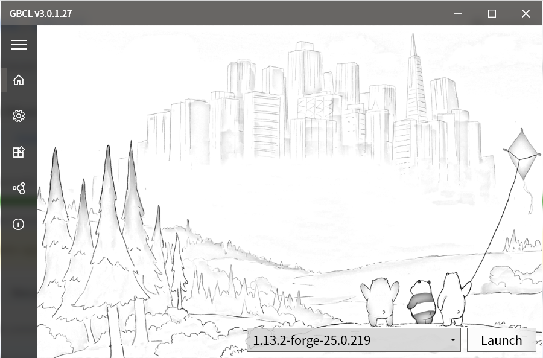
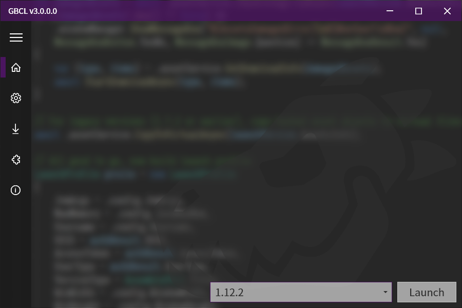
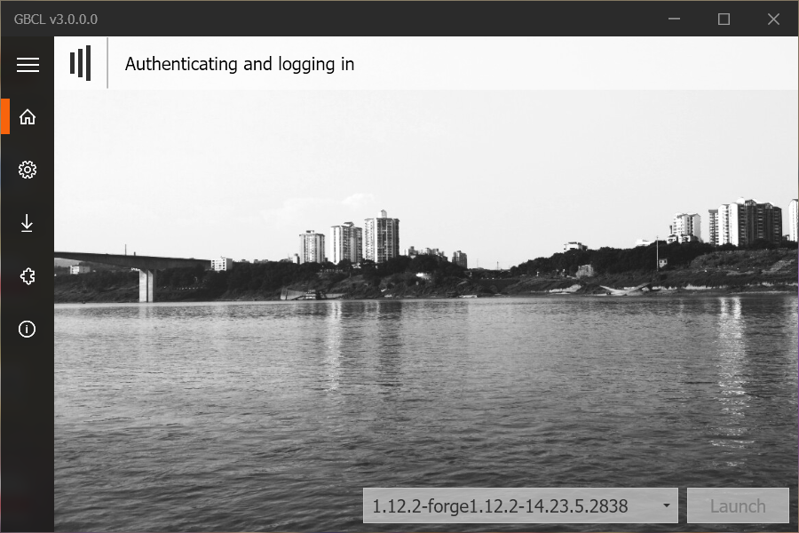
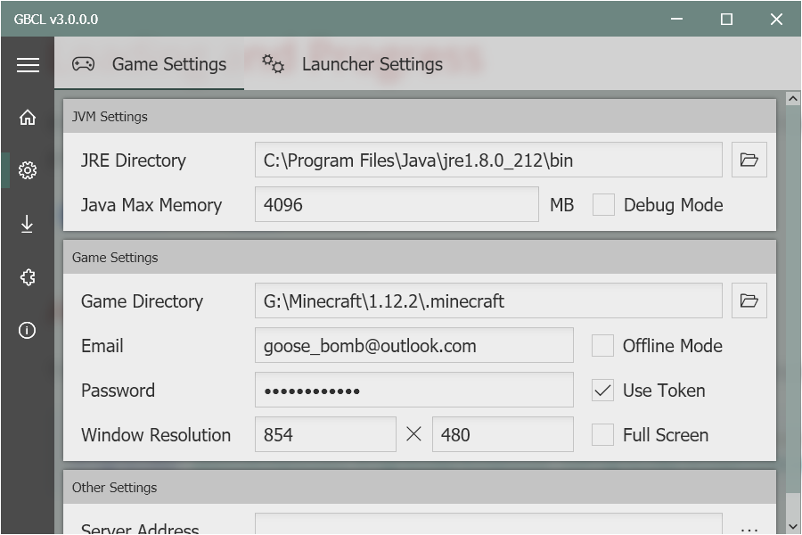
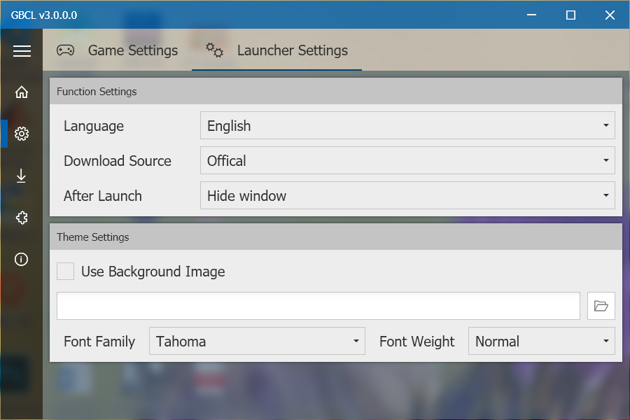

#  GBCLV3
   

Goose Bomb's Minecraft Client Launcher V3
[简体中文](./README-CN.md)

## Features

* MVVM Framework 🧶
* Simple and easy to use (I hope so 🤣)
* Win10-style 😎✨

## Development Progress

- [x] Game Launch
  - [x] Auto JRE detection
  - [x] Version segregation
  - [x] 1.13+ Support
  - [x] Forge version
  - [x] Authentication

- [ ] Download
  - [x] Parallel download
  - [x] Retry incomplete downloads
  - [x] Fix damaged dependencies (main jar, libraries, assets)
  - [ ] Install new version
  - [ ] Install forge

- [ ] Custom Theme
  - [x] Blur-behind window
  - [x] Custom background image
  - [x] Custom font
  - [x] Use system accent color
  - [ ] Custom theme color

- [ ] Multi Language
  - [x] English
  - [x] Simplified Chinese
  - [ ] Traditional Chinese
  - [ ] Japanese

- [ ] Additional functions
  - [ ] Mods management
  - [ ] Resourcepacks management
  - [ ] Saves management

## Screenshots

