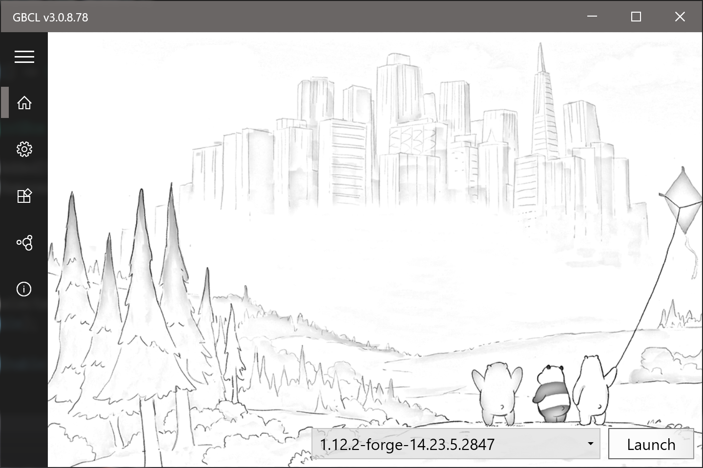
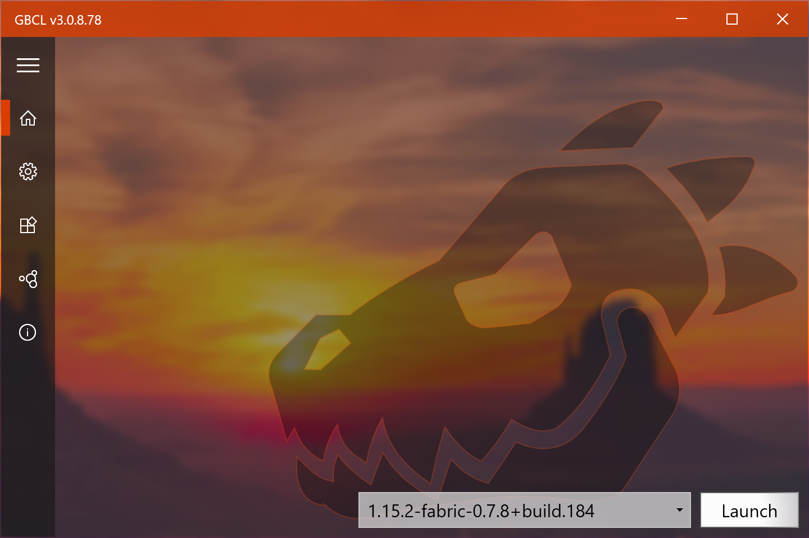
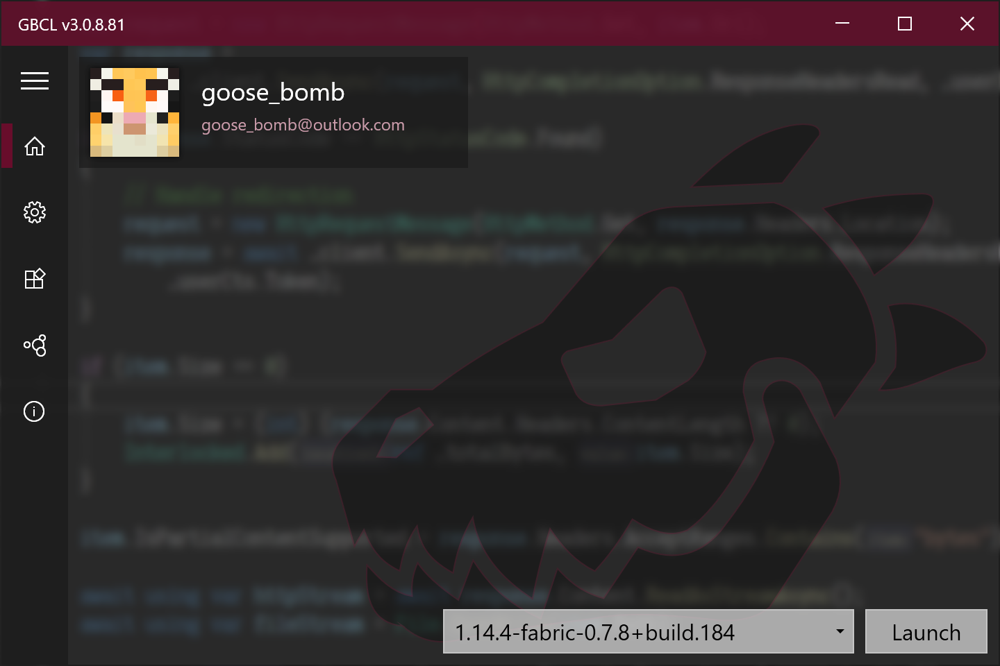
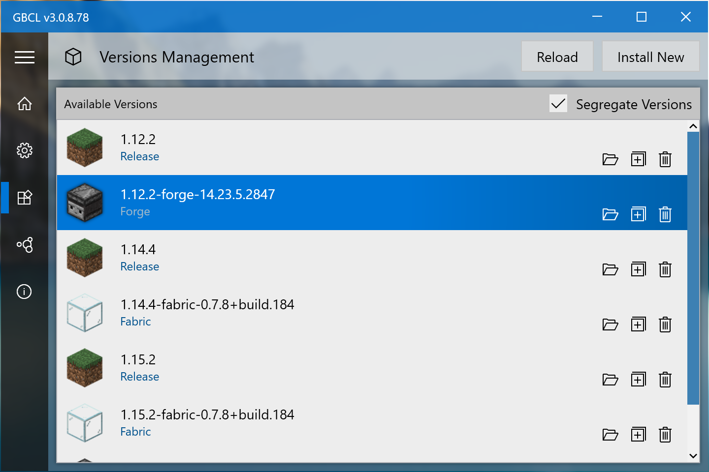
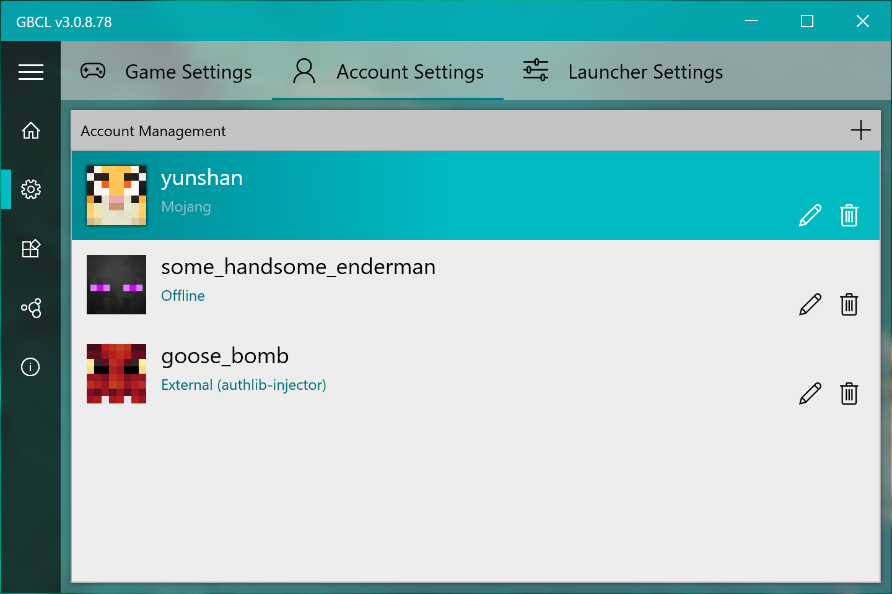
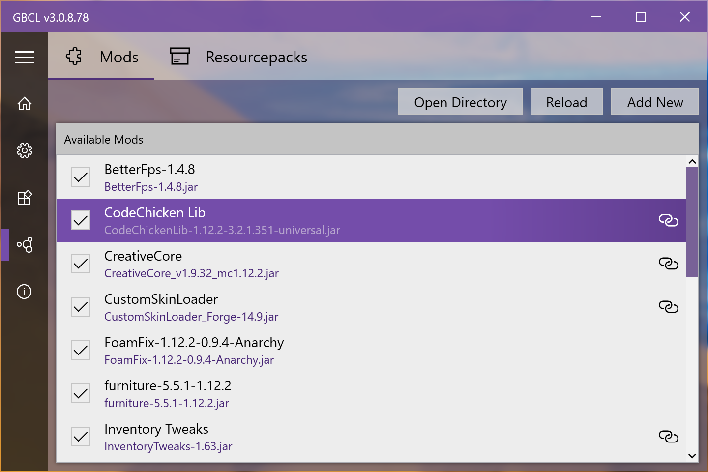

  
  <h2 align="center">GBCLV3</h2>
  

    
    
        
    
    <a href="https://github.com/Goose-Bomb/GBCLV3/releases">
      
          
    </a>
  

  
Goose Bomb's Minecraft Client Launcher V3

[简体中文](./README-CN.md)

## System Requirement
* Windows 10 x64 Only
* [.NET Core 3.1 Desktop Runtime](https://dotnet.microsoft.com/download/dotnet-core/3.1) is required!

## Highlights

* MVVM Framework 🧶
* Simple and easy to use (I hope so 🤣)
* Win10-style 😎✨

## Features

- [x] Game Launch
  - [x] Auto JRE path detection
  - [x] Version segregation
  - [x] 1.13+ Support
  - [x] Forge version
  - [x] Fabric version

- [x] Authentication
  - [x] Account Manegement
  - [x] Email and Password Login
  - [x] Token Refresh
  - [ ] External authentication ([authlib-injector](https://github.com/yushijinhun/authlib-injector))

- [x] Download and Installation
  - [x] Parallel http download
  - [x] Retry incomplete downloads
  - [x] Fix damaged dependencies (main jar, libraries, assets)
  - [x] Install new version
  - [x] Install Forge
  - [x] Install Fabric

- [ ] Custom Theme
  - [x] Blur-behind window
  - [x] Custom background image
  - [x] Custom font
  - [x] Use system accent color
  - [ ] Custom theme color

- [ ] Multi Language
  - [x] English
  - [x] Simplified Chinese
  - [ ] Traditional Chinese
  - [ ] Japanese

- [ ] Auxiliary Functions
  - [x] Mods management
  - [x] Resourcepacks management
  - [ ] Saves management
  - [ ] Skin managemnet

- [x] Auto update (Github based)

## Screenshots

